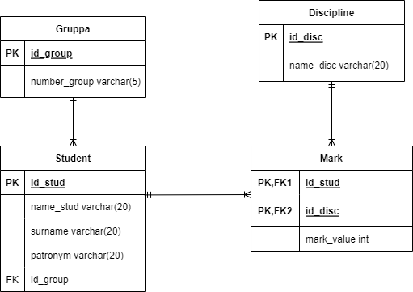
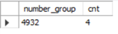

## Тестовое задание
У нас есть ВУЗ, в нем учатся студенты - в разных группах, ходят на разные занятия/лекции, сдают зачеты и экзамены, получают оценки. 
Задание:
1. Спроектировать базу данных, где будет отражена базовая информация о студентах и их учебе (таблицы, поля, связи между ними). Результат - структура БД.  
2. Написать запрос: выбрать все те группы, где есть хотя бы три студента со средним баллом выше 4,75. Результат – запрос.  
3. Написать план тестирования реализованной функциональности.

## Физическая модель базы данных, находящаяся в третьей нормальной форме 



### 2.	DDL-скрипты по созданию объектов БД. 
```SQL
create database University;
use University;
CREATE TABLE Gruppa
(
id_group int NOT NULL AUTO_INCREMENT PRIMARY KEY, 
number_group varchar(5) NOT NULL
);
CREATE TABLE Student
(
id_stud int NOT NULL AUTO_INCREMENT PRIMARY KEY, 
id_group int NOT NULL,
CONSTRAINT fk_group FOREIGN KEY  (id_group) REFERENCES Gruppa (id_group) ON DELETE NO ACTION ON UPDATE CASCADE,
name_stud varchar(20) NOT NULL,
surname varchar(20) NOT NULL,
patronym varchar(20) NOT NULL
);

CREATE TABLE Discipline
(
id_disc int NOT NULL AUTO_INCREMENT PRIMARY KEY, 
name_disc varchar(20) NOT NULL
);


CREATE TABLE Mark
(
id_stud int NOT NULL,
id_disc int NOT NULL , 
PRIMARY KEY (id_stud,id_disc),
CONSTRAINT fk_stud FOREIGN KEY  (id_stud) REFERENCES Student (id_stud) ON DELETE NO ACTION ON UPDATE NO ACTION,
CONSTRAINT fk_disc FOREIGN KEY  (id_disc) REFERENCES Discipline (id_disc) ON DELETE CASCADE ON UPDATE CASCADE,
mark_value int
);
```
### 3.	DML-скрипты по наполнению БД тестовыми данными.
``` SQL
insert into Gruppa(id_group,number_group) values(1,'4932'),(2,'4933'),(3,'4931');
insert into Student(id_stud,id_group,name_stud,surname,patronym) values(1,1,'Иванов','Иван','Иванович'),
(2,1,'Петров','Федор','Иванович'),
(3,1,'Сидорова','Алена','Сергеевна'),
(4,2,'Федеров','Александр','Евгеньевич'),
(5,2,'Русских','Владимир','Владимирович'),
(6,2,'Валенкова','Людмила','Ивановна'),
(7,3,'Александрова','Мария','Дмитриевна'),
(8,3,'Соколов','Константин','Юрьевич'),
(9,3,'Достовалов','Илья','Игоревич'),
(10,3,'Льняных','Николай','Илларионович'),
(11,1,'Ворошилов','Захар','Любимович');

insert into Discipline(id_disc,name_disc) values(1,'Математика'),
(2,'Физика'),
(3,'Иностранный'),
(4,'Информатика');

insert into Mark(id_stud,id_disc,mark_value) values(1,1,5),
(1,2,5),
(1,3,5),
(1,4,5),
(2,1,5),
(2,2,5),
(2,3,5),
(2,4,5),
(3,1,5),
(3,2,5),
(3,3,5),
(3,4,5),
(4,1,5),
(4,2,5),
(4,3,5),
(4,4,5),
(5,1,3),
(5,2,3),
(5,3,3),
(5,4,3),
(6,1,3),
(6,2,3),
(6,3,3),
(6,4,3),
(7,1,3),
(7,2,3),
(7,3,3),
(7,4,5),
(8,1,4),
(8,2,4),
(8,3,4),
(8,4,3),
(9,1,3),
(9,2,4),
(9,3,5),
(9,4,4),
(10,1,3),
(10,2,5),
(10,3,4),
(10,4,3),
(11,1,5),
(11,2,5),
(11,3,5),
(11,4,5);
```

### Cкрипт запроса по заданию

``` SQL
select number_group, count(id_stud) cnt from 
(
SELECT id_stud, id_group, number_group, round(AVG(mark_value),2) as mk from Student s
join Gruppa g using(id_group)
join Mark m using(id_stud) GROUP BY id_stud, id_group
having mk > 4.75
) t
group by id_group
having cnt >= 3
;
```
### Результат

### План тестирования реализованной функциональности
•	Добавить студентов со средним баллом выше 4,75 в разные группы и проверить, покажет ли запрос корректное количество
•	Удалить всех студентов, у которых средний балл выше 4,75
•	Написать тестовые запросы, вывести всех студентов и их средний балл и проверить корректность вывода первого запроса
